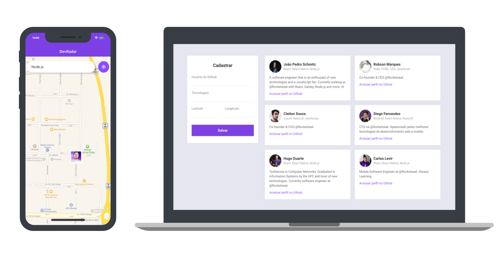

   

# DevRadar

> Projeto desenvolvido durante a semana Omnistack 10.0, visando conectar desenvolvedores próximos a você que trabalham com as mesmas tecnologias.

   

## :postbox: Faq

**Pergunta:** Quais as tecnologias usadas nesse projeto?

**Resposta:** Esse projeto foi desenvolvido com as seguintes tecnologias:

- [Node.js](https://nodejs.org/en/)
- [React](https://reactjs.org)
- [React Native](https://facebook.github.io/react-native/)
- [Expo](https://expo.io/)

## :closed_book: License

Esse projeto está sob a licença MIT. Veja o arquivo [LICENSE](LICENSE.md) para mais detalhes.

Made by [Eduardo Assunção](https://github.com/cunhaedu)
